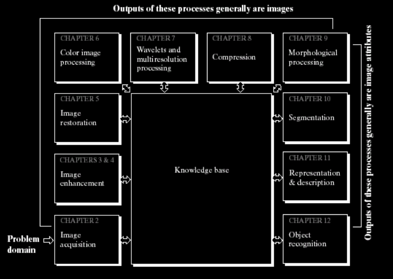
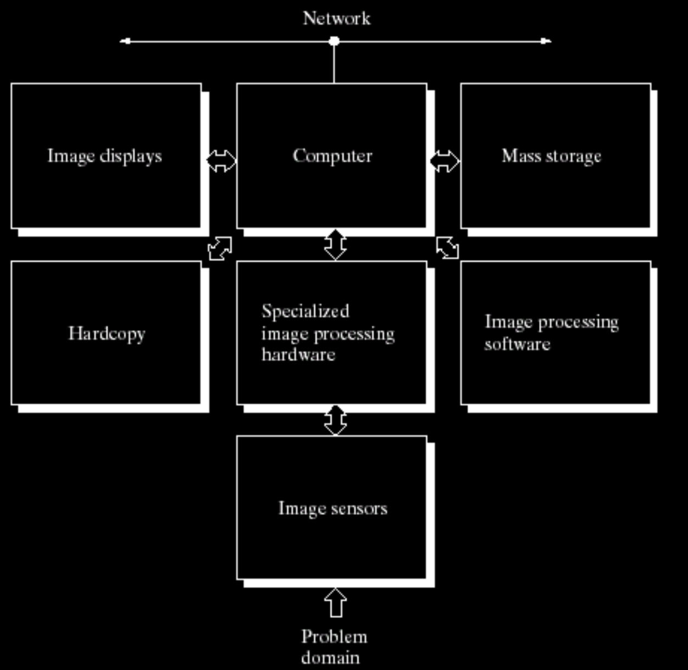
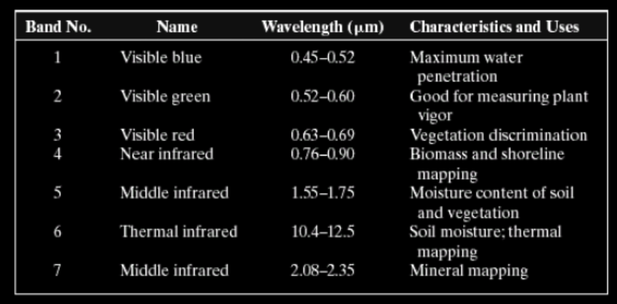

# Digital Image Processing Fundamentals
Notes based on **Chapter 2** of Gonzalez and Woods: *Digital Image Fundamentals*.

## 1. Fundamental Steps in Digital Image Processing

Digital Image Processing (DIP) involves several stages to convert an image into a form suitable for specific applications. The workflow typically follows this hierarchy:

1.  **Image Acquisition**: The first step is capturing the image using a sensor (e.g., a camera). It involves digitizing a continuous signal into a discrete format.
2.  **Image Enhancement**: The process of manipulating an image so that the result is *more suitable* than the original for a specific application (e.g., adjusting contrast or brightness).
3.  **Image Restoration**: Unlike enhancement, which is subjective, restoration is **objective** and aims to improve an image based on mathematical or probabilistic models of image degradation (e.g., removing blur or noise).
4.  **Color Image Processing**: Deals with color models and processing in the color domain, which is vital due to the increased use of digital images over the internet.
5.  **Wavelets and Multiresolution Processing**: Represents images in various degrees of resolution, useful for data compression and pyramidal representation.
6.  **Compression**: Reducing the storage required to save an image or the bandwidth required to transmit it.
7.  **Morphological Processing**: Deals with tools for extracting image components that are useful in the representation and description of shape (e.g., skeletons, convex hulls).
8.  **Segmentation**: The process of partitioning an image into its constituent parts or objects (e.g., finding a person in a crowd).
9.  **Representation and Description**: Follows segmentation; it transforms raw data into a form suitable for computer processing (e.g., describing a shape by its boundary or regional properties).
10. **Object Recognition**: Assigning a label to an object based on its descriptors (e.g., identifying an object as a "vehicle").

### The Image Processing System
To perform these tasks, a specialized "general purpose" system is required, consisting of:

*   **Image Sensors**: These sit at the front, interacting with the "Problem Domain" to capture light or energy.
*   **Specialized Hardware**: Often dedicated boards for high-speed processing.
*   **Computer & Software**: The brain and the instructions that run the algorithms.
*   **Storage**: "Mass storage" is critical because images are data-hungry.
*   **Output**: This includes image displays for viewing and hardcopy devices (printers) for physical results.

---

# Imaging Notes

## 1. Gamma Ray Imaging

### Applications
- **Nuclear Medicine** and **astronomical observations**

### Principle (Nuclear Medicine)
A patient is injected with a radioactive isotope that emits gamma rays as it decays. Images are produced from the emissions collected by a gamma ray detector.

---

### Positron Emission Tomography (PET)

- The principle is similar to X-ray tomography.
- The patient is given a radioactive isotope that **emits positrons** as it decays.
- When a positron meets an electron, **both are annihilated** and **two gamma rays** are emitted in opposite directions.
- These gamma rays are detected and used to construct a **tomographic image**.
- The collected gamma rays are used to construct a **CT (Computed Tomography)** image.

**Example Image:** Bone Scan
- A radioactive isotope is injected; as it decays it emits positrons.
- Positron-electron annihilation generates two gamma rays that are detected to form the image.

---

### Astronomical Application – Cygnus Loop

- A star in the **constellation of Cygnus** exploded approximately **15,000 years ago**.
- This explosion generated a **superheated stationary gas cloud** known as the **Cygnus Loop**.
- The Cygnus Loop is located **15,000 light-years from Earth**.
- It serves as a **natural gamma ray source** used in astronomical gamma ray imaging.

---

### Summary of Gamma Ray Imaging Examples (Figure 1.6)
| Image | Description |
|-------|-------------|
| (a) Bone Scan | Full-body gamma ray scan of the skeletal system |
| (b) PET Image | Tomographic image constructed from detected gamma rays |
| (c) Cygnus Loop | Astronomical gamma ray image of a supernova remnant |
| (d) Reactor Valve | Gamma radiation (bright spot) from a reactor valve |

---

## 2. X-Ray Imaging

### Overview
- X-rays are among the **oldest sources of electromagnetic (EM) radiation** used for imaging.

### Applications
- Medical diagnostics
- Astronomy
- Industry (e.g., circuit board inspection)

### Principle

1. X-rays are generated using an **X-ray tube** — a vacuum tube containing a **cathode** and an **anode**.
2. The cathode is **heated**, causing the release of **free electrons**.
3. These high-speed electrons **strike a nucleus**, releasing energy in the form of **X-ray radiation** (Bremsstrahlung radiation).
4. The energy of the X-ray is controlled by the **current applied to the filament** in the cathode.
5. A **film or digital sensor** collects the transmitted rays to form the image.

### Special Technique – Angiography
- A **contrast medium** (dye) is injected into the body to enhance visibility of blood vessels.

---

### Summary of X-Ray Imaging Examples (Figure 1.7)
| Image | Description |
|-------|-------------|
| (a) Chest X-ray | Standard thoracic X-ray for medical diagnosis |
| (b) Aortic Angiogram | X-ray of blood vessels using contrast medium |
| (c) Head CT | Cross-sectional computed tomography of the head |
| (d) Circuit Boards | Industrial X-ray imaging of electronic components |
| (e) Cygnus Loop | Astronomical X-ray image from NASA |

---

## 3. Ultraviolet (UV) Imaging

### Principle
- UV imaging uses **ultraviolet light** to excite molecules in a sample.
- The excited molecules emit **visible radiation** through a process called **fluorescence**.
- This fluorescence is then captured to form the image.

### Application – Microphotography
- UV imaging is used in **microphotography** to distinguish between:
  - **Normal corn**
  - **Corn infected by parasites**
- The difference in fluorescence between healthy and infected tissue makes parasitic infection clearly visible.

---

## Key Comparisons

| Imaging Type | Source | Primary Use | Key Feature |
|---|---|---|---|
| Gamma Ray | Radioactive isotopes / natural sources | Nuclear medicine, astronomy | Detects gamma rays from annihilation or decay |
| PET | Positron-emitting isotopes | Medical tomography | Constructs 3D CT images from gamma ray pairs |
| X-Ray | X-ray tube (electron-nucleus collision) | Medical, industrial, astronomy | Transmitted rays captured on film/sensor |
| Ultraviolet | UV light source | Microscopy, biology | Uses fluorescence to reveal details |

## 2. Elements of Visual Perception: The Human Eye
Why study the eye in a computer science context? Because the goal is often to create images for humans to view. We need to understand the "receiver" of the data.

### Physical Components
The eye is a complex biological camera with several key components:
*   **Cornea and Sclera**: The tough, transparent outer cover and the white of the eye.
*   **Choroid**: A layer that contains blood vessels and helps absorb stray light.
*   **Iris**: Acts like a camera's aperture, contracting and expanding to control light entry through the pupil. It can vary the pupil diameter from approximately **2 mm to 8 mm** to adapt to lighting conditions.
*   **Lens**: Unlike a glass camera lens, the human lens is flexible. It changes shape (controlled by ciliary muscles) to focus.
*   **Retina**: The innermost membrane where the actual "imaging" happens.

### Light Receptors
The retina is covered in two distinct classes of receptors: **Cones** and **Rods**.

**1. Cones (Photopic Vision)**
*   There are approximately **6–7 million** per eye.
*   Primarily located in the **fovea**, the center of the retina.
*   Highly sensitive to **color** and **fine detail**.
*   Known as "bright-light vision".

**2. Rods (Scotopic Vision)**
*   There are far more rods—between **75 and 150 million**—distributed over the retinal surface.
*   Sensitive to **low levels of illumination**.
*   **Not involved in color vision**.
*   Known as "dim-light vision".

**The Blind Spot**: The region where the optic nerve leaves the eye. Because there are no receptors there, you effectively cannot see light that hits that specific spot.

### Resolving Power
The eye's "resolving power" is comparable to modern electronic sensors. The fovea is roughly a square sensor array of $1.5 \text{ mm} \times 1.5 \text{ mm}$. With a density of 150,000 elements/mm², the fovea has about **337,000 elements**. A modern Charge-Coupled Device (CCD) can match this resolving power in a space no larger than $5 \text{ mm} \times 5 \text{ mm}$.

### Brightness Adaptation and Discrimination
The Human Visual System (HVS) is incredibly flexible. It can adapt to an enormous range of light intensity levels—roughly on the order of $10^{10}$. However, the eye cannot see this entire range *simultaneously*.

*   **Brightness Adaptation Level**: At any given moment, the eye operates at a specific "current sensitivity".
*   **Subjective Brightness**: Our perception of brightness is a **logarithmic function** of the light intensity incident on the eye.
*   **Simultaneous Range**: At any given adaptation level, the range of intensities the eye can discriminate is actually quite small compared to the total $10^{10}$ range.

#### The Weber Ratio Experiment
The objective of this experiment is to determine the **just noticeable difference (JND)** in light intensity that a human eye can perceive against a specific background. This helps in understanding why we see "false contouring" in digital images with low bit depths.

**1. Experimental Setup**
The experiment typically involves a controlled environment to isolate the variables of light intensity:
*   **The Stimulus**: A subject is presented with a uniform background of constant intensity, denoted as $I$.
*   **The Increment**: At the center of this background, a short-duration flash or a solid circular disk of a slightly different intensity, $I + \Delta I$, is introduced.
*   **The Subject**: The person performing the test is asked to indicate whether they can perceive the central disk against the background.

**2. The Procedure**
The experiment is repeated across a wide range of background intensities ($I$):
*   **Fixed Background**: Start with a very low background intensity $I$.
*   **Incremental Adjustment**: Gradually increase the central intensity $\Delta I$ from zero until the subject reports seeing the disk 50% of the time (the threshold of perception).
*   **Recording the JND**: This specific value is recorded as $\Delta I_c$, the "just noticeable" increment.
*   **Repeat**: The background $I$ is increased to a higher level, and the process is repeated to find the new $\Delta I_c$.

**3. Calculating the Weber Ratio**
The results are expressed as a ratio, known as the Weber Ratio:

$$\text{Weber Ratio} = \frac{\Delta I_c}{I}$$

**Significance of the Magnitude**
The magnitude of the Weber ratio tells us how "sensitive" our eyes are at different light levels:

| Magnitude | Interpretation | Visual Significance |
| :--- | :--- | :--- |
| **Small Ratio** | **High Sensitivity**: A very small change in intensity is easily noticed. | Occurs at high intensities. The eye is excellent at discriminating subtle shades. |
| **Large Ratio** | **Low Sensitivity**: A large change in intensity is required for the eye to notice it. | Occurs at very low intensities (scotopic vision). This is why "noise" is more visible in dark areas of a photo. |

**Why it matters in Digital Image Processing**
*   **Bit Depth Selection**: Since our sensitivity changes with intensity, we often use non-linear quantization (like Log or Power-Law transformations) to give more bits to the ranges where the Weber ratio is smallest (where we are most sensitive).
*   **False Contouring**: If the gap between two digital gray levels is larger than the $\Delta I_c$ for that background intensity, the human eye will perceive a "step" or a line instead of a smooth gradient, leading to false contouring.

**Crucial Observation**: In a typical monochrome image, a person can typically see only about **1 to 2 dozen different intensities** at any single point in time.

### Visual Perception Phenomena
Our eyes don't just act like light meters; they interpret data in ways that can be "tricked."
*   **Mach Bands**: Our visual system tends to undershoot or overshoot around the boundaries of regions with different intensities. This makes the edges look sharper than they actually are.
*   **Simultaneous Contrast**: A region's perceived brightness depends heavily on its background. A gray square looks much darker against a white background than it does against a black one.
*   **Optical Illusions**: The eye often "fills in" non-existing information or wrongly perceives geometrical properties (e.g., misjudging parallel lines).

---

## 3. Light and the Electromagnetic Spectrum
Visible light is just a tiny sliver of the much broader **Electromagnetic (EM) Spectrum**. This spectrum ranges from high-energy gamma rays with incredibly short wavelengths to low-energy radio waves with very long wavelengths.

### Key Relationships
*   **Wavelength ($\lambda$)**: Measured in meters, microns ($\mu m$), or nanometers (nm).
*   **Frequency ($\nu$)**: Measured in Hertz (Hz).
*   **Relationship**: Wavelength and frequency are inversely related by the speed of light ($c \approx 2.998 \times 10^8 \text{ m/s}$):
$\lambda = \frac{c}{\nu}$
*   **Energy ($E$)**: The energy of a photon is proportional to its frequency: $E = h\nu$, where $h$ is Planck's constant.

### The Visible Spectrum
The portion of the spectrum that humans can actually see spans from approximately **0.43 µm (violet)** to **0.79 µm (red)**.
*   **Violet**: $\sim 400 \text{ nm}$
*   **Green**: $\sim 500 \text{ nm}$
*   **Yellow**: $\sim 600 \text{ nm}$
*   **Red**: $\sim 700 \text{ nm}$

### Key Light Properties
*   **Monochromatic (Achromatic) Light**: Light "void of color," having only one attribute: **intensity** or gray level. The range of these measured values is called the **gray scale**.
*   **Chromatic Light**: Light with color, characterized by three factors:
    1.  **Radiance**: The total amount of energy (in Watts, W) flowing from the light source.
    2.  **Luminance**: A measure of how much energy an observer *perceives* from the source, measured in lumens (lm).
    3.  **Brightness**: A purely **subjective** descriptor of light perception. It is practically impossible to measure directly because it depends on the human viewer.

---

## 4. Image Sensing and Acquisition
How do we turn EM energy into a digital image? It requires a physical process of **Combination** (illumination source + reflection/absorption), **Transformation** (sensor converts energy to voltage), and **Digitization**.

### Image Formation Model
We represent images as a two-dimensional function $f(x,y)$, where the value at any spatial coordinate is the positive scalar **intensity**.
$f(x,y) = i(x,y) \cdot r(x,y)$
*   **Illumination ($i$)**: The range is $0 < i(x,y) < \infty$.
*   **Reflectance ($r$)**: The range is $0 < r(x,y) < 1$. A value of 0 indicates total absorption (black), while 1 indicates total reflectance.
    *   *Examples*: Black velvet $\approx 0.01$, Stainless steel $\approx 0.65$, Snow $\approx 0.93$.

### Types of Imaging Sensors
Sensors are typically made of silicon (e.g., photodiodes) with filters for selectivity.
1.  **Single Sensor**: Combined with mechanical motion (like a lead screw) to scan a 2-D area. Inexpensive but slow.
2.  **Sensor Strips**: A line of sensors captures one image line at a time. Common in flatbed scanners and airborne imaging.
3.  **Sensor Arrays**: The most prevalent arrangement for digital cameras. An entire 2-D grid of sensors captures the scene simultaneously.

### CCD vs. CMOS Technology
Most modern digital cameras use one of two competing sensor array technologies:

| Feature | CCD (Charge-Coupled Device) | CMOS (Complementary Metal-Oxide) |
| :--- | :--- | :--- |
| **Readout** | One row at a time, transferred to a serial output register. | Active pixel sensors that can provide data faster. |
| **Power** | Higher power consumption. | Uses less power. |
| **Size** | Generally larger system footprint. | Can be significantly smaller. |
| **Maturity** | More mature technology with high quality. | Integrated with fewer components. |

### Sampling and Quantization
To process the continuous image $f(x,y)$ on a computer, it must be digitized:
1.  **Sampling**: Discretizing the **spatial coordinates** (the $x$ and $y$ values). The number of sensors in an array usually determines the sampling limits.
2.  **Quantization**: Discretizing the **amplitude values** (the intensity or gray levels).

---

## 5. Digital Image Representation
After sampling and quantization, the image is represented as a discrete 2-D array $f(x,y)$ with $M$ rows and $N$ columns.

### Matrix Representation
For computational efficiency, we write the image as a matrix:

$$f(x,y) = \begin{bmatrix}
f(0,0) & f(0,1) & \cdots & f(0,N-1) \\
f(1,0) & f(1,1) & \cdots & f(1,N-1) \\
\vdots & \vdots & \ddots & \vdots \\
f(M-1,0) & f(M-1,1) & \cdots & f(M-1,N-1)
\end{bmatrix}$$

### Intensity Levels and Storage
*   The number of discrete intensity levels, $L$, is typically a power of 2: $L = 2^k$.
*   **Dynamic Range**: The ratio of the maximum to minimum detectable intensity. Low dynamic range causes a "washed-out" look.
*   **Storage Requirements**: The number of bits ($b$) to store an image is:
$b = M \times N \times k$
    *   An image with $2^8 = 256$ intensity values is called an **8-bit image**.

### Resolution and Artifacts

#### 1. Spatial Resolution
Spatial resolution refers to the smallest discernible detail in an image. It is fundamentally determined by the number of pixels used to represent the scene ($M \times N$).

**Advantages of High Spatial Resolution:**
*   **High Fidelity:** Captures fine details, textures, and sharp edges, making it essential for analytical tasks.
*   **Better Scaling:** High-resolution images can be enlarged or zoomed without becoming "pixelated" or blurry.

**Disadvantages of High Spatial Resolution:**
*   **Storage Requirements:** Increasing the number of pixels significantly increases the file size (e.g., doubling dimensions quadruples the storage).
*   **Computational Cost:** More pixels require more processing power and time for filtering, enhancement, and analysis.

**Applications:**
*   **Medical Imaging:** Critical for identifying small tumors in X-rays or Gamma-ray scans.
*   **Satellite Remote Sensing:** Used for identifying specific geographical features, vehicles, or buildings from space.
*   **Document Scanning:** High DPI ensures that small text and intricate logos remain legible.

#### 2. Intensity (Radiometric) Resolution
Intensity resolution refers to the smallest discernible change in gray level. It is determined by the number of bits ($k$) used to represent each pixel, yielding $L = 2^k$ levels.

**Advantages of High Intensity Resolution:**
*   **Smooth Gradients:** Allows for subtle transitions between colors or gray levels, preventing visual artifacts.
*   **Increased Information:** Essential for scientific applications where small variations in intensity represent physical data (e.g., temperature or density).

**Disadvantages of High Intensity Resolution:**
*   **Bit Depth Overhead:** Using 16-bit depth instead of 8-bit doubles the storage for the same number of pixels.
*   **Display Constraints:** Most standard monitors only support 8-bit or 10-bit color, so extremely high intensity resolution may not be visually perceivable without specialized hardware.

**Applications:**
*   **Night Vision Imaging:** High sensitivity to small intensity changes is vital for seeing objects in low-light environments.
*   **Astronomical Imaging:** Detecting the faint light of distant stars against a dark background requires high bit depth.
*   **Professional Photography (RAW format):** Photographers use 12-bit or 14-bit depth to allow for greater flexibility in post-processing.

#### 3. False Contouring
False contouring is a visual artifact that occurs when the intensity resolution is too low to represent smooth transitions in an image.

**Mechanism:** When there are insufficient gray levels, a smooth gradient is forced into a few discrete steps. The human eye perceives these discrete steps as "stair-case" bands or artificial contours that were not present in the original scene.

**Advantages (Context-Specific):**
*   In specific artistic contexts, "posterization" (intentional false contouring) can be used for stylistic effect.
*   Reduced bit depth can be used intentionally to compress data in non-critical applications where visual perfection is not required.

**Disadvantages:**
*   **Visual Distraction:** It creates unnatural lines in smooth areas like skies or skin tones.
*   **Loss of Subtle Information:** Important details hidden within a gradient may be merged into a single "contour," losing critical data.

**Applications/Mitigation:**
*   **Dithering:** A technique used in image processing to minimize the visibility of false contouring by adding noise to the image, which tricks the eye into seeing smoother transitions.
*   **Medical Diagnostics:** It is critical to avoid false contouring in medical scans, as an artifact could be mistaken for a physical boundary or tissue abnormality.

---

## 6. Image Interpolation
Interpolation is the process of using known data to **estimate values at unknown locations**. It is essential for zooming, shrinking, rotating, and geometric corrections.

1.  **Nearest Neighbor Interpolation**: Assigns the intensity of the *closest* pixel to the new location.
    *   *Pros*: Simple and fast.
    *   *Cons*: Strong tendency to produce artifacts like "jagged" edges.
2.  **Bilinear Interpolation**: Uses the **four nearest neighbors** to estimate intensity.
    *   *Model*: $v(x,y) = ax + by + cxy + d$
    *   *Result*: Much smoother than nearest neighbor.
3.  **Bicubic Interpolation**: Uses the **16 nearest neighbors**.
    *   *Model*: $v(x,y) = \sum_{i=0}^3 \sum_{j=0}^3 a_{ij} x^i y^j$
    *   *Result*: The standard for high-quality commercial image editing; sharper and smoother than bilinear.

---

## 7. Relationships Between Pixels
To develop algorithms, we define how pixels relate to one another.

### Neighbors of a Pixel p(x,y)
1.  **4-neighbors** $N_4(p)$: Horizontal and vertical neighbors: $(x+1,y),\ (x-1,y),\ (x,y+1),\ (x,y-1)$.
2.  **Diagonal neighbors** $N_D(p)$: The four diagonal neighbors: $(x+1,y+1),\ (x+1,y-1),\ (x-1,y+1),\ (x-1,y-1)$.
3.  **8-neighbors** $N_8(p)$: The union of $N_4(p)$ and $N_D(p)$.

### Adjacency
Adjacency determines which pixels are considered neighbors of a given pixel.
Assume a pixel $p$ at coordinates $(x, y)$.

**(a) 4-Adjacency ($N_4$)**
A pixel has four neighbors:
*   $(x - 1, y) \rightarrow$ left
*   $(x + 1, y) \rightarrow$ right
*   $(x, y - 1) \rightarrow$ up
*   $(x, y + 1) \rightarrow$ down

Only horizontal and vertical neighbors are considered.
*   ✔ Used when diagonal connections should NOT count.
*   ✔ Produces simpler connectivity structures.

**(b) 8-Adjacency ($N_8$)**
Includes 4-neighbors plus diagonal neighbors:
*   $(x - 1, y - 1)$
*   $(x - 1, y + 1)$
*   $(x + 1, y - 1)$
*   $(x + 1, y + 1)$

So total = 8 neighbors.
*   ✔ Allows diagonal connections.
*   ✔ Produces thicker connected regions.

**(c) m-Adjacency (Mixed Adjacency)**
Used to avoid ambiguity in connectivity.
Two pixels are m-adjacent if:
1.  They are 4-adjacent, **OR**
2.  They are diagonal neighbors and do not share a common 4-neighbor that belongs to the same set.

*   ✔ Prevents double connections.
*   ✔ Often used in digital topology.

### Connectivity
Connectivity determines whether two pixels belong to the same region.
Two pixels are connected if:
1.  They are adjacent (4, 8, or m), **AND**
2.  Their intensity values belong to the same set (e.g., both are foreground pixels).

**Types of Connectivity**
*   **4-Connectivity**: A region is 4-connected if you can move between any two pixels using only 4-adjacent steps.
*   **8-Connectivity**: A region is 8-connected if movement through diagonal pixels is allowed.
*   **m-Connectivity**: Avoids connectivity paradoxes when diagonal pixels touch at corners.

### Distance Function
A **distance function** is a function of two points, $p$ and $q$, in space that satisfies three criteria:
1. **Non-negativity**: $D(p, q) \geq 0$
2. **Symmetry**: $D(p, q) = D(q, p)$
3. **Triangle Inequality**: $D(p, z) \leq D(p, q) + D(q, z)$

### Distance Measures
For pixels $p(x,y)$ and $q(s,t)$:
*   **Euclidean Distance ($D_e$)**: The "straight-line" distance (circular radius).
$D_e(p,q) = \sqrt{(x-s)^2 + (y-t)^2}$
*   **City-Block (Manhattan) Distance ($D_4$)**: Measured along horizontal and vertical paths (diamond shape).
$D_4(p,q) = |x-s| + |y-t|$
*   **Chessboard Distance ($D_8$)**: The maximum difference between coordinates (square shape).
$D_8(p,q) = \max(|x-s|, |y-t|)$

### Basic Definitions
*   **Path**: A sequence of distinct pixels where each consecutive pair is adjacent.
*   **Connected Component**: All pixels in a subset connected to a given pixel.
*   **Edge**: A path of pixels that separates two regions with significantly different gray levels.

---

## 8. Arithmetic Operations

Arithmetic operations are performed on a pixel-by-pixel basis between two images of the same size.

*   **Addition**: Used for **Image Averaging**. By averaging different noisy images of the same scene, we can significantly reduce random noise. This is a fundamental technique in fields like **astronomy**.
*   **Subtraction**: Used for **Image Subtraction** to enhance the differences between two images. A common application is **Mask Mode Radiography**, where a "mask" image is subtracted from a live image to highlight specific changes, such as blood flow in an angiogram.
*   **Multiplication and Division**: Often used for **Shading Correction**. For instance, if an image has uneven lighting (shading), multiplying the original by the reciprocal of the shading pattern produces a corrected, uniform result. Multiplication is also used for **Masking** (Region of Interest or ROI), where a binary mask (1s for object, 0s for background) is multiplied with an image to isolate specific parts (e.g., teeth in a dental X-ray).

---

## 9. Set and Logical Operations

These operations treat images—particularly binary images—as sets of pixel coordinates.

*   **Set Operations**: Include **Union**, **Intersection**, **Complement**, and **Difference**.
    *   For gray-scale images, the **Union** is formed by taking the maximum intensity at each corresponding pixel location.
*   **Logical Operations**: Operations like **AND**, **OR**, **NOT**, **XOR**, and **AND-NOT** are applied to binary images where white pixels represent 1s (foreground) and black pixels represent 0s (background).
    *   A **NOT** operation on a gray-scale image produces its **Negative**.

---

## 10. Spatial Operations

Spatial operations modify pixel values based on their location or their relationship to nearby pixels.

*   **Single-Pixel Operations**: Alter a pixel's value based *only* on its current intensity, such as applying a transformation function to obtain an image negative.
*   **Neighborhood Operations**: The value of a pixel in the output is determined by the values of pixels in a neighborhood around the corresponding input pixel. A classic example is **Local Averaging**, where each pixel is replaced by the average of its neighbors to "blur" or smooth the image.
*   **Geometric Spatial Transformations**: Often called **"rubber-sheet" transformations**, consisting of two steps:
    1.  **Spatial Transformation of Coordinates**: Moving pixels to new locations using **Affine Transforms** (scaling, rotation, translation, shearing).
    2.  **Intensity Interpolation**: Assigning intensity values to those new locations using interpolation methods (Nearest Neighbor, Bilinear, Bicubic).

---

## 11. Image Registration

Image registration is a critical process used to align two or more images of the same scene taken at different times, from different viewpoints, or by different sensors.

*   **The Problem**: Often, you have an "input" image and a "reference" image, but the specific geometric transformation between them is unknown.
*   **The Solution**: We estimate a transformation function to "register" the input against the reference.
*   **Tie Points (Control Points)**: The most common approach. You identify corresponding points in both images whose locations are known precisely—like the corners of a building or a specific road intersection.

---

## 12. Vector and Matrix Operations

Modern image processing often leverages linear algebra by treating image data as vectors and matrices.

### 12.1 Vectors: Multispectral and Color Pixels
In a single-band (grayscale) image, a pixel is a scalar. However, in **multispectral** or **RGB** images, a pixel at spatial location $(x,y)$ is represented as a column vector $\mathbf{z}$ of dimension $n$ (where $n$ is the number of bands):

$$ \mathbf{z} = \begin{bmatrix} z_1 \\ z_2 \\ \vdots \\ z_n \end{bmatrix} $$

For a standard RGB image, $n=3$, where $z_1, z_2, z_3$ correspond to the Red, Green, and Blue intensities, respectively.

### 12.2 Euclidean Distance and Similarity
Vector norms are used to measure the "distance" or similarity between two pixel vectors. This is critical for **color matching**, **object recognition**, and **segmentation**.

*   **Euclidean Distance ($D_E$)**: To determine how similar a pixel $\mathbf{z}$ is to a reference color vector $\mathbf{a}$:

$$D(\mathbf{z}, \mathbf{a}) = ||\mathbf{z} - \mathbf{a}|| = \sqrt{(\mathbf{z} - \mathbf{a})^T (\mathbf{z} - \mathbf{a})} = \sqrt{\sum_{i=1}^n (z_i - a_i)^2}$$

*   *Application*: All pixels $\mathbf{z}$ where $D(\mathbf{z}, \mathbf{a}) < T$ (a threshold) can be classified as belonging to the object defined by color $\mathbf{a}$.

### 12.3 Linear Transformations
Pixel vectors can be transformed linearly to new coordinate spaces (e.g., converting RGB to YCbCr components).

$$\mathbf{w} = \mathbf{A}(\mathbf{z} - \mathbf{a})$$
Where $\mathbf{A}$ is an $n \times n$ matrix and $\mathbf{a}$ is an average vector.
*   **Principal Component Analysis (PCA)**: Also known as the **Hotelling Transform**, this technique uses the covariance matrix of the pixel vectors to align the data along the directions of maximum variance (eigenvectors). It is widely used for **data compression** and **feature extraction** (e.g., Eigenfaces).

### 12.4 Matrix Operations on Whole Images
An entire $M \times N$ image can be treated as a matrix $\mathbf{F}$.
*   **Element-wise Operations**: Standard arithmetic (addition, subtraction) is performed element-by-element (e.g., $\mathbf{A} + \mathbf{B}$).
*   **Image Transforms (Unitary Transforms)**: Transforms like the Fourier or Discrete Cosine Transform (DCT) can be expressed as matrix multiplication:
    $$ \mathbf{T} = \mathbf{U} \mathbf{F} \mathbf{V}^T $$
    Where $\mathbf{U}$ and $\mathbf{V}$ are transformation matrices (containing basis functions). This matrix representation is fundamental to **JPEG compression**.

---

## 13. Image Transforms

Sometimes, a task that is very difficult to do in the standard spatial domain (the actual $x, y$ coordinates) becomes much easier in a different mathematical "space" called the **Linear Transform Domain**.

The general approach follows these steps:
1.  **Transform**: Convert the spatial domain image $f(x, y)$ into a transform domain $T(u, v)$.
2.  **Operation**: Perform the specific image processing task (Operation $R$) within this new domain.
3.  **Inverse Transform**: Apply the inverse transform to bring the data back into the spatial domain to get the final processed image $g(x, y)$.

---

## 14. Image Domains

Image processing techniques are broadly divided into two domains:

1.  **The Spatial Domain**: Operates directly on the pixels of an image.
    *   **Point Processing**: Operations on a single pixel (e.g., contrast adjustment).
    *   **Neighborhood Processing**: Operations that consider a group of pixels (e.g., blurring).
    *   **Pipeline**: Expressed as $g(x,y) = T[f(x,y)]$, where $f$ is the input, $g$ is the output, and $T$ is the transformation.
2.  **The Transform Domain**: Uses mathematical transforms (like Fourier) to convert the image into coefficients representing "frequencies". These are modified and then inversely transformed to create the output.

### Neighborhood Processing in Spatial Domain
To generate an output pixel at $(x,y)$, a **neighborhood** (e.g., $3 \times 3$ grid) is defined around the corresponding input pixel. The transformation $T$ is applied to the pixels in this window to calculate the new value.

---

## 15. Basic Intensity Transformation Functions (Point Processing)

The simplest spatial domain operations where transformation $T$ depends only on the intensity of a single pixel: $s = T(r)$, where $r$ is input intensity and $s$ is output intensity.

1.  **Image Negatives**: Flips the intensity scale ($s = L-1-r$).
    *   **Application**: Enhancing white/gray details embedded in dark regions (e.g., mammograms).
2.  **Log Transformations**: $s = c \log(1+r)$.
    *   **Function**: Maps a narrow range of low-intensity inputs to a wider set of output levels.
    *   **Application**: Visualizing the **Fourier Transform**, expanding dark pixels to reveal structural detail.
3.  **Power-Law (Gamma) Transformations**: $s = c r^\gamma$.
    *   **$\gamma < 1$**: Expands dark regions, compresses bright regions.
    *   **$\gamma > 1$**: Compresses dark regions, expands bright regions.
    *   **$\gamma = 1$**: Identity transformation.
    *   **Application (Gamma Correction)**: Correcting the power-law response of display devices (e.g., CRT monitors) to ensure images appear naturally to the human eye.

        **Gamma Correction Overview**
        Gamma correction is a nonlinear operation used in image processing to adjust the brightness and contrast of an image in a way that better matches human visual perception and display characteristics.

        **Why Gamma Correction Is Needed**
        
        *   Human eyes perceive brightness nonlinearly (we’re more sensitive to changes in dark tones than bright ones).
        *   Cameras and displays also respond nonlinearly to light.
        *   Without gamma correction, images may look too dark, washed out, or lose detail in shadows or highlights.
        *   Gamma correction bridges the gap between:
            *   Physical light intensity
            *   Digital pixel values
            *   Human perception

        **Common Use Cases**

        *   Display systems (most monitors use $\gamma \approx 2.2$)
        *   Image enhancement (revealing shadow details)

---

## 16. Piecewise-Linear Transformation Functions

Transformations made of linear segments connected at specific points, allowing surgical control over intensities.

1.  **Contrast Stretching**: Expands the range of intensity levels in a low-contrast image to span the full scale (black to white).
    *   **Thresholding**: An extreme case where the function becomes a vertical line, converting a grayscale image to binary (black and white).

2.  **Intensity-Level Slicing**: Highlights a specific range of gray levels $[A, B]$.
    *   **Binary Slicing**: Sets pixels in range to white, others to black.
    *   **Non-destructive**: Highlights range but preserves other gray levels.

3.  **Bit-Plane Slicing**: analyzing an 8-bit image as 8 separate "bit-planes".
    *   **Bit-Plane 8 (MSB)**: Contains structural information.
    *   **Bit-Plane 1 (LSB)**: Contains fine detail/noise.
    *   **Applications**: Image reconstruction (compression) and data hiding (watermarking).

---

## 17. Histogram Processing

Analysis based on the statistical distribution of pixel intensities. A **histogram** is a discrete function $h(r_k) = n_k$, where $n_k$ is the count of pixels with intensity $r_k$.

### Histogram Analysis
*   **Dark Image**: Components concentrated on the low (left) side.
*   **Light Image**: Biased toward the high (right) side.
*   **Low-Contrast**: Narrow, centered distribution ("gray" look).
*   **High-Contrast**: Broad, uniform distribution covering the full scale.

### Techniques
1.  **Histogram Equalization**: An automatic method to "stretch" the histogram to be uniform.
    *   **Formula**: $s_k = T(r_k) = (L-1) \sum_{j=0}^{k} p_r(r_j)$
    *   **Result**: Increases dynamic range and contrast, revealing hidden details.
2.  **Histogram Matching (Specification)**: Modifying an image so its histogram matches a specific specified shape (not necessarily uniform).

### Example: Histogram Equalization Problem

**Problem 1**: A 3-bit image ($L=8$) of size $64 \times 64$ pixels ($MN=4096$) has an intensity distribution given in the table below. The goal is to determine its equalized histogram.

**1. Data from Table 3.1**

Based on standard versions of this example, the intensity distribution is:

| $r_k$ | $n_k$ (Number of pixels) | $p_r(r_k) = n_k / MN$ |
| :--- | :--- | :--- |
| $r_0 = 0$ | 790 | 0.19 |
| $r_1 = 1$ | 1023 | 0.25 |
| $r_2 = 2$ | 850 | 0.21 |
| $r_3 = 3$ | 656 | 0.16 |
| $r_4 = 4$ | 329 | 0.08 |
| $r_5 = 5$ | 245 | 0.06 |
| $r_6 = 6$ | 122 | 0.03 |
| $r_7 = 7$ | 81 | 0.02 |
| **Total** | **4096** | **1.00** |

**2. Calculation Steps**

The transformation function for histogram equalization is given by the formula:
$$s_k = T(r_k) = (L-1) \sum_{j=0}^{k} p_r(r_j)$$

For a 3-bit image, $L-1 = 7$.

*   **$s_0$**: $7 \times (0.19) = 1.33 \rightarrow \mathbf{1}$
*   **$s_1$**: $7 \times (0.19 + 0.25) = 7 \times 0.44 = 3.08 \rightarrow \mathbf{3}$
*   **$s_2$**: $7 \times (0.44 + 0.21) = 7 \times 0.65 = 4.55 \rightarrow \mathbf{5}$
*   **$s_3$**: $7 \times (0.65 + 0.16) = 7 \times 0.81 = 5.67 \rightarrow \mathbf{6}$
*   **$s_4$**: $7 \times (0.81 + 0.08) = 7 \times 0.89 = 6.23 \rightarrow \mathbf{6}$
*   **$s_5$**: $7 \times (0.89 + 0.06) = 7 \times 0.95 = 6.65 \rightarrow \mathbf{7}$
*   **$s_6$**: $7 \times (0.95 + 0.03) = 7 \times 0.98 = 6.86 \rightarrow \mathbf{7}$
*   **$s_7$**: $7 \times (0.98 + 0.02) = 7 \times 1.00 = 7.00 \rightarrow \mathbf{7}$

**3. Equalized Histogram Result**

The new intensity levels ($s_k$) are mapped from the old levels ($r_k$). Since some values round to the same integer, we sum their probabilities:

*   **Output Level 1**: $p_s(s_1) = 0.19$
*   **Output Level 3**: $p_s(s_3) = 0.25$
*   **Output Level 5**: $p_s(s_5) = 0.21$
*   **Output Level 6**: $p_s(s_6) = 0.16 + 0.08 = 0.24$
*   **Output Level 7**: $p_s(s_7) = 0.06 + 0.03 + 0.02 = 0.11$

This transformation spreads the intensities more uniformly across the scale, which is the primary goal of histogram equalization.

---

## 18. Spatial Filtering (Neighborhood Processing)

A pixel's new value is determined by its neighboring pixels using a **Filter** (Mask/Kernel).

### Mechanics
*   **Alignment**: Center of filter placed over pixel $(x,y)$.
*   **Calculation**: Mathematical operation using filter coefficients and covered pixels.

### Linear Spatial Filtering
A weighted average of the neighborhood (sum-of-products):
$g(x,y) = \sum_{s=-a}^{a} \sum_{t=-b}^{b} w(s,t)f(x+s, y+t)$

### Spatial Correlation vs. Convolution (in Image Processing)

Both **spatial correlation** and **convolution** are operations used in signal and image processing to apply a filter (kernel) to data. They are very similar mathematically, but differ in one key step.

---

#### 1️⃣ Spatial Correlation

**Definition:**
Spatial correlation slides a kernel over an image and computes the sum of element-wise multiplications **without flipping the kernel**.

**Formula (2D case):**

$$g(x, y) = \sum_{i}\sum_{j} f(x+i, y+j) h(i, j)$$

* $f(x,y)$ = input image
* $h(i,j)$ = kernel
* $g(x,y)$ = output image

**Key Characteristics:**

* No flipping of the kernel.
* Often used for **template matching** and **feature detection**.
* If the kernel matches a pattern in the image, the output value is high.

**Example uses:**

* Edge detection
* Pattern recognition
* Template matching

---

#### 2️⃣ Convolution

**Definition:**
Convolution is similar to correlation, but the kernel is flipped both horizontally and vertically before sliding.

**Formula (2D case):**

$$g(x, y) = \sum_{i}\sum_{j} f(x-i, y-j) h(i, j)$$

This is equivalent to:

$$g(x, y) = \sum_{i}\sum_{j} f(x+i, y+j) h(-i, -j)$$

**Key Characteristics:**

* Kernel is flipped (rotated 180° in 2D).
* Fundamental operation in:
  * Linear systems
  * Filtering
  * Deep learning (CNNs)

---

#### 🔎 Main Difference

| Feature                 | Correlation                                       | Convolution                  |
| ----------------------- | ------------------------------------------------- | ---------------------------- |
| Kernel Flipping         | ❌ No                                              | ✅ Yes (180° rotation)        |
| Mathematical Properties | Not commutative                                   | Commutative                  |
| Used in CNNs            | Often called convolution but actually correlation | True convolution (in theory) |

---

#### 🎯 Important Note (Deep Learning)

In **Convolutional Neural Networks (CNNs)**, such as those introduced by Yann LeCun, the operation commonly called "convolution" is technically **cross-correlation** (no kernel flipping).

However, since the kernel is learned during training, the distinction does not affect performance. So libraries implement cross-correlation because it's slightly computationally efficient.

> If the kernel is symmetric (e.g., Gaussian blur), flipping makes no difference — both operations produce the same result.

### Edge Handling
When filters hang off the image edge:
*   **Ignore edges**: Output image is smaller.
*   **Padding**: Add rows/columns of zeros (or other values) around the border.

---

## 19. Smoothing Spatial Filters

Smoothing (Lowpass) Filters are used primarily for blurring and noise reduction.

### The Purpose of Blurring
*   **Object Extraction**: Removes small details before extracting large objects.
*   **Bridging Gaps**: Connects small gaps in lines or curves.
*   **Noise Reduction**: Smooths out sharp transitions (often random noise).
*   **Reducing False Contouring**: Blends transitions in images with few gray levels.

### 1. Linear Smoothing Filters (Averaging)
Replaces every pixel with the average intensity of its neighborhood.
*   **Box Filter**: All coefficients have the same value (e.g., 1), multiplied by a normalizing constant.
*   **Weighted Average Filter**: Center pixels are given higher weight to reduce edge blurring.

### 2. Non-Linear Smoothing Filters (Order-Statistics)
Based on ranking pixels in the neighborhood rather than mathematical sums.
*   **Median Filter**: Replaces the center pixel with the *median* value. Excellent for removing "salt-and-pepper" noise while preserving edges.
*   **Max Filter**: Replaces center with the brightest value (finds bright points).
*   **Min Filter**: Replaces center with the darkest value.

---

## 20. Sharpening Spatial Filters

Sharpening (Highpass) Filters highlight transitions in intensity (edges, noise, fine detail) using **spatial differentiation**.

### The Role of Derivatives
*   **First Derivative**: $\frac{\partial f}{\partial x} = f(x+1) - f(x)$. Non-zero at the onset of a step/ramp.
*   **Second Derivative**: $\frac{\partial^2 f}{\partial x^2} = f(x+1) + f(x-1) - 2f(x)$. Non-zero at the start and end of a step/ramp; zero along the ramp.
*   **Key**: The second derivative enhances fine detail much better than the first.

### 1. The Laplacian (Second-Order Derivative)
An isotropic (rotation invariant) operator.
*   **Formula**: $\nabla^2 f(x,y) = f(x+1,y) + f(x-1,y) + f(x,y+1) + f(x,y-1) - 4f(x,y)$
*   **Sharpening**: Subtract (or add) the Laplacian from the original image:
$g(x,y) = f(x,y) + c[\nabla^2 f(x,y)]$

### 2. Unsharp Masking and Highboost Filtering
Sharpening using a blurred mask.
1.  **Blur** the original image ($f^*$).
2.  **Create Mask**: Subtract blurred image from original: $g_{mask}(x,y) = f(x,y) - f^*(x,y)$.
3.  **Add Mask**: $g(x,y) = f(x,y) + k \cdot g_{mask}(x,y)$.
    *   **$k=1$**: Unsharp Masking.
    *   **$k>1$**: Highboost Filtering.

### 3. The Gradient (First-Order Derivative)
Points in the direction of the greatest rate of change. We typically use the **Gradient Magnitude**:
$M(x,y) \approx |g_x| + |g_y|$
*   **Roberts Cross-Gradient**: Uses $2 \times 2$ masks.
*   **Sobel Operators**: Uses $3 \times 3$ masks (provides smoothing + derivative).

---

## 21. Introduction to the Frequency Domain

Based on the Fourier Transform (FT), which represents any periodic function as a weighted sum of sines and cosines.

### The "New Neighborhood"
*   **Spatial Domain ($f$)**: Intensity at specific $(x,y)$ locations.
*   **Frequency Domain ($F$)**: The rate at which intensities change across the image.

### Advantages
1.  **Removing Periodic Noise**: Distinct noise patterns appear as "bursts" in the frequency domain, which can be easily masked out.
2.  **Computational Efficiency**: Convolution in the spatial domain is equivalent to simple **multiplication** in the frequency domain (Convolution Theorem).

---

## 22. Sampling and the Nyquist Rate

To use FT on computers, continuous signals must be **sampled** at intervals $\Delta T$.

### The Sampling Theorem
*   **Band-limited Functions**: Fourier transform is zero outside $[-\mu_{max}, \mu_{max}]$.
*   **The Nyquist Rate**: To perfectly recover a signal, the sampling rate must be more than twice the highest frequency:
$\frac{1}{\Delta T} > 2\mu_{max}$

### Aliasing
The consequence of under-sampling (sampling slower than Nyquist rate). High-frequency components "fold over" and appear as lower frequencies, causing artifacts like **Moiré patterns** or jagged edges.

---

